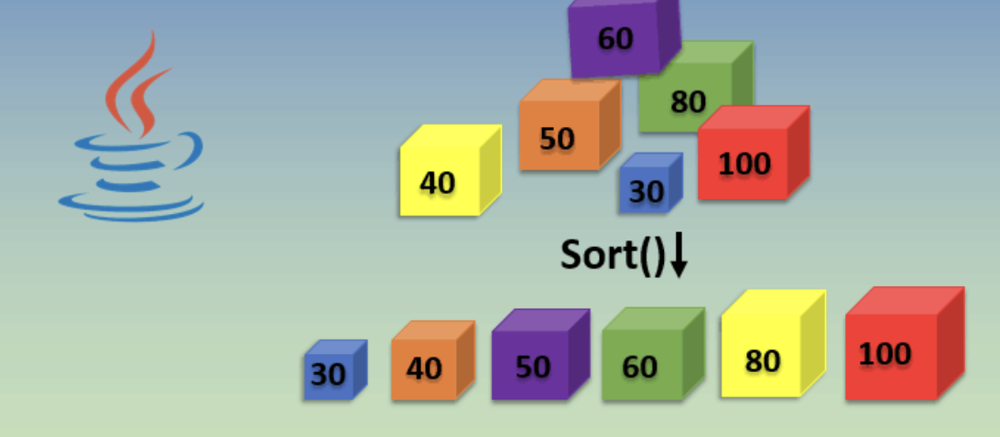

<h1 align="center">Sorting algorithms @ Sparta</h1>

<p align="center">
  <a href="#description">Description and requirements</a> •
  <a href="#checklist">Checklist</a> •
  <a href="#screencasts">Screencasts</a> •
  <a href="#credits">Credits</a> •
  <a href="#license">License</a> •
  <a href="#contact">Contact</a> 
</p>

---

## Description and Requirements

The purpose of this project is to practice more advanced Java features. The task is to implement different sorting algorithms by using design patterns, SOLID principles, Java conventions and integrate the different Java features from the checklist while building up the project.

Below the project requirements: 


>Bubble Sort Project
>
>Purpose: To give you a chance to create some classes, write an algorithm and do some testing.
>
>Write the code to take an array of ints and, using the bubble sort algorithm, return the array with its elements stored in ascending order.
>
>Use at least 2 classes in your implementation (one to drive everything, one to do the sorting). 
>
>Write unit tests for your sorting class.


>Quicksort Extension.
>
>Purpose: To get experience with using interfaces in Java and build a simple user interface.
>
>Extend your existing bubble sort app to add another class to sort using quick sort instead. Make both classes implement a shared interface (or possibly extend the same abstract class) and make sure the driver takes advantage of this implementation/extension. Add a simple UI which allows the user to select their preferred sort algorithm, or possibly run both to compare the execution times. Write appropriate JUnit tests for the new class.


----

## Checklist

- [x] SOLID Principles
- [x] MVC Pattern
- [x] Factory Design Patterns
- [x] Use of interfaces / abstract classes
- [x] Use of generics
- [x] Exception Handling
- [x] Loggers
- [x] Use of constants (import static)
- [x] Sorting algortihms
  - [x] Bubble sort
  - [x] Quick sort
  - [ ] Binary Tree sort feat nested classes

---


## Screencasts


<details>
  <summary>Click to expand screencasts</summary>
  <h4>
    Bubble sort
  </h4>
  <h4>
    Quick sort
  </h4>
  <h4>
    Error messages
  </h4>
</details>


## Directory structure

```bash
.
├── README.md
├── SortingAlgorithms.iml
├── images
│   ├── eng100-@sparta.svg
│   └── made-with-java.svg
├── logs
│   └── mylogfile.log
├── pom.xml
├── src
│   ├── main
│   │   ├── java
│   │   │   └── com
│   │   │       └── sparta
│   │   │           └── sortingalgos
│   │   │               ├── Driver.java
│   │   │               ├── README.md
│   │   │               ├── controller
│   │   │               │   └── SortingController.java
│   │   │               ├── model
│   │   │               │   ├── BubbleSort.java
│   │   │               │   ├── ISorting.java
│   │   │               │   ├── QuickSort.java
│   │   │               │   ├── SortingFactory.java
│   │   │               │   └── TreeSort.java
│   │   │               ├── utils
│   │   │               │   ├── BeforeAfter.java
│   │   │               │   ├── Logging.java
│   │   │               │   ├── RandomGenerator.java
│   │   │               │   ├── SortingType.java
│   │   │               │   └── Timing.java
│   │   │               └── view
│   │   │                   └── SortingView.java
│   │   └── resources
│   │       └── log4j2.properties
│   └── test
│       └── java
│           └── com
│               └── sparta
│                   └── sortingalgos
│                       ├── BubbleSortTest.java
│                       └── QuickSortTest.java
└── target
    ├── classes
    │   ├── com
    │   │   └── sparta
    │   │       └── sortingalgos
    │   │           ├── Driver.class
    │   │           ├── controller
    │   │           │   ├── SortingController$1.class
    │   │           │   └── SortingController.class
    │   │           ├── model
    │   │           │   ├── BubbleSort.class
    │   │           │   ├── ISorting.class
    │   │           │   ├── QuickSort.class
    │   │           │   ├── SortingFactory$1.class
    │   │           │   ├── SortingFactory.class
    │   │           │   └── TreeSort.class
    │   │           ├── utils
    │   │           │   ├── BeforeAfter.class
    │   │           │   ├── Logging.class
    │   │           │   ├── RandomGenerator.class
    │   │           │   ├── SortingType.class
    │   │           │   └── Timing.class
    │   │           └── view
    │   │               └── SortingView.class
    │   └── log4j2.properties
    ├── generated-sources
    │   └── annotations
    ├── generated-test-sources
    │   └── test-annotations
    └── test-classes
        └── com
            └── sparta
                └── sortingalgos
                    ├── BubbleSortTest.class
                    └── QuickSortTest.class
```


## Credits


## License

Free

## Contact

> [alexsusanu.com](https://www.alexsusanu.com) &nbsp;&middot;&nbsp;
> GitHub [@alexsusanu](https://github.com/alexsusanu) &nbsp;&middot;&nbsp;


  

