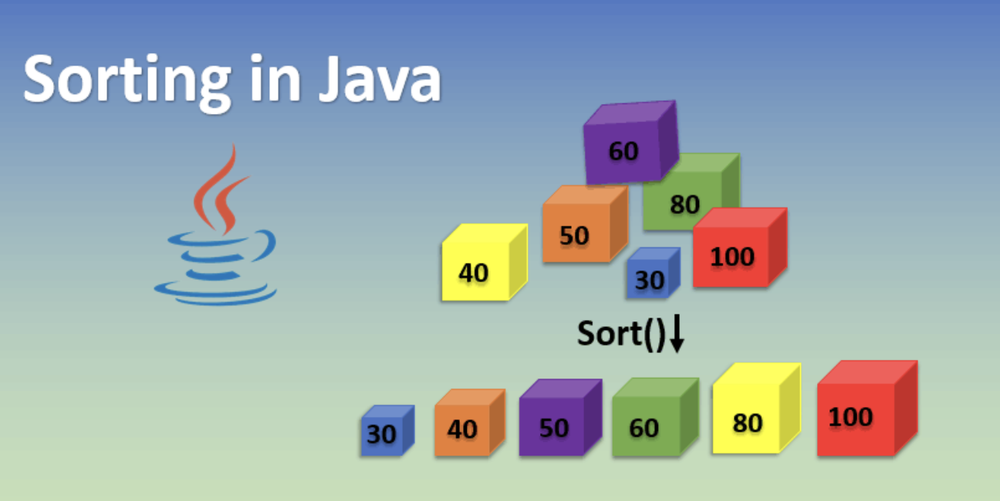

<p style="text-align: center; font-size: 150%">Sorting Algorithms @ Sparta </p>


<p align="center">
  <a href="#java-features">Java Features Used</a> •
  <a href="#description">Description</a> •
  <a href="#credits">Credits</a> •
  <a href="#license">License</a> •
  <a href="#contact">Contact</a> 
</p>


## Java Features Used

- //TODO

## Description

//TODO

## Directory structure

```bash
.
├── README.md
├── SortingAlgorithms.iml
├── images
│   ├── eng100-@sparta.svg
│   └── made-with-java.svg
├── logs
│   └── mylogfile.log
├── pom.xml
├── src
│   ├── main
│   │   ├── java
│   │   │   └── com
│   │   │       └── sparta
│   │   │           └── sortingalgos
│   │   │               ├── Driver.java
│   │   │               ├── README.md
│   │   │               ├── controller
│   │   │               │   └── SortingController.java
│   │   │               ├── model
│   │   │               │   ├── BubbleSort.java
│   │   │               │   ├── ISorting.java
│   │   │               │   ├── QuickSort.java
│   │   │               │   ├── SortingFactory.java
│   │   │               │   └── TreeSort.java
│   │   │               ├── utils
│   │   │               │   ├── BeforeAfter.java
│   │   │               │   ├── Logging.java
│   │   │               │   ├── RandomGenerator.java
│   │   │               │   ├── SortingType.java
│   │   │               │   └── Timing.java
│   │   │               └── view
│   │   │                   └── SortingView.java
│   │   └── resources
│   │       └── log4j2.properties
│   └── test
│       └── java
│           └── com
│               └── sparta
│                   └── sortingalgos
│                       ├── BubbleSortTest.java
│                       └── QuickSortTest.java
└── target
    ├── classes
    │   ├── com
    │   │   └── sparta
    │   │       └── sortingalgos
    │   │           ├── Driver.class
    │   │           ├── controller
    │   │           │   ├── SortingController$1.class
    │   │           │   └── SortingController.class
    │   │           ├── model
    │   │           │   ├── BubbleSort.class
    │   │           │   ├── ISorting.class
    │   │           │   ├── QuickSort.class
    │   │           │   ├── SortingFactory$1.class
    │   │           │   ├── SortingFactory.class
    │   │           │   └── TreeSort.class
    │   │           ├── utils
    │   │           │   ├── BeforeAfter.class
    │   │           │   ├── Logging.class
    │   │           │   ├── RandomGenerator.class
    │   │           │   ├── SortingType.class
    │   │           │   └── Timing.class
    │   │           └── view
    │   │               └── SortingView.class
    │   └── log4j2.properties
    ├── generated-sources
    │   └── annotations
    ├── generated-test-sources
    │   └── test-annotations
    └── test-classes
        └── com
            └── sparta
                └── sortingalgos
                    ├── BubbleSortTest.class
                    └── QuickSortTest.class
```


## Credits


## License

Free

## Contact

> [alexsusanu.com](https://www.alexsusanu.com) &nbsp;&middot;&nbsp;
> GitHub [@alexsusanu](https://github.com/alexsusanu) &nbsp;&middot;&nbsp;


