### ERD Diagram

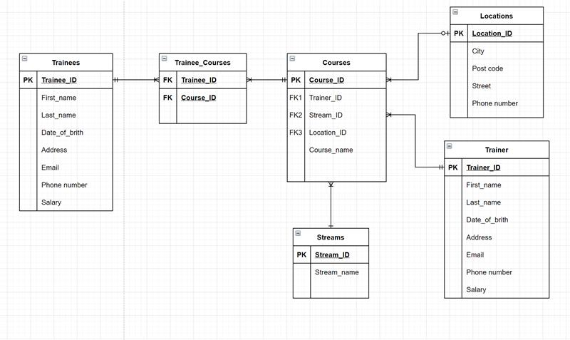


```sql
-- drop table in this order. no FK first

drop table if EXISTS Trainees; -- no initial FK
drop table if EXISTS Streams; -- no initial FK
drop table if EXISTS Trainers; -- no initial FK
drop table if EXISTS Locations; -- no initial FK
drop table if EXISTS Courses; -- FK with Trainers Streams and Locations
drop table if EXISTS Trainee_Courses;-- FK with Trainees, Courses
```


```sql
create table Trainees(
    trainee_id int IDENTITY(1,1) PRIMARY KEY not null,
    first_name varchar(100) not null,
    last_name varchar(100) not null,
    dob datetime,
    address varchar(MAX),
    email varchar(100) not null,
    phone_number char(11) not null,
    salary varchar(50)
);

INSERT INTO Trainees
VALUES
  ('Charlotte','Prescott Phelps','Mar 12, 2021','P.O. Box 146, 1389 Donec Av.','aenean.eget@aol.ca','08132835882',1256),
  ('Hayes','Montana Hudson','Jun 13, 2022','3687 Magnis Rd.','nunc@hotmail.net','03481423781',1346),
  ('Freya','Celeste Dixon','Jul 26, 2021','Ap #185-9871 Vestibulum. St.','varius.ultrices@google.couk','08454647',1317),
  ('Medge','Colin Gamble','Jul 21, 2022','125-4173 Neque Street','adipiscing.lacus@yahoo.edu','01131066081',1884),
  ('Robin','Stuart Franco','Jul 22, 2022','Ap #879-812 Aliquam Street','pellentesque.ut@protonmail.com','03377367446',1361);

  select * from Trainees
```

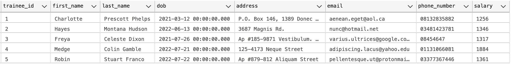

```sql
create table Trainers(
    trainer_id int IDENTITY(1,1) PRIMARY KEY not null,
    first_name varchar(100) not null,
    last_name varchar(100) not null,
    dob datetime,
    address varchar(MAX),
    email varchar(100) not null,
    phone_number char(11) not null,
    salary varchar(50)
);

INSERT INTO Trainers
VALUES
  ('Keegan','Burke Key','Feb 6, 2022','4728 Facilisis Street','amet.orci@hotmail.couk','08454644',5268),
  ('Darrel','Bert Trevino','Jun 10, 2022','P.O. Box 315, 1941 Luctus Road','imperdiet@aol.edu','07967445365',5064),
  ('Pearl','Jemima Bernard','Oct 5, 2021','Ap #528-8565 Malesuada Rd.','ornare.libero@aol.ca','03242328486',5950),
  ('Julie','Garth Lane','Jan 11, 2021','9509 Molestie Rd.','dolor.vitae@icloud.couk','0169777056',5405),
  ('Jillian','Ivana Sampson','Oct 25, 2022','973-4276 Molestie Street','maecenas.iaculis.aliquet@yahoo.net','08454641',3966);

  select * from Trainers;
```

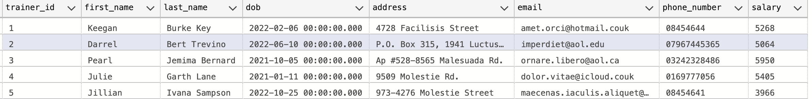

```sql
create table Streams(
    stream_id int IDENTITY(1,1) PRIMARY KEY not null,
    stream varchar(MAX)
);

INSERT INTO Streams
VALUES
  ('Java'),
  ('C#'),
  ('DevOps'),
  ('BA'),
  ('DataEng');

select * from Streams;
```


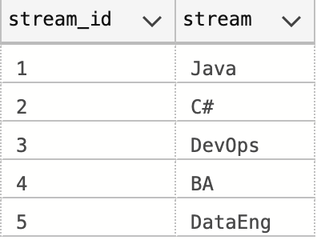

```sql
create table Locations(
    location_id int IDENTITY(1,1) PRIMARY KEY not null,
    city varchar(50) not null,
    postcode varchar(10) not null,
    street varchar(MAX) not null,
    phone_number char(11)
);

INSERT INTO Locations
VALUES
  ('London','W2 2FP','32 In St.','07017367847'),
  ('Birmingham','BR2 6UP','1493 Elit. Rd.','01163885518'),
  ('Manchester','M23 4OB','8982 Morbi Ave','0165394409'),

  select * from Locations;
```

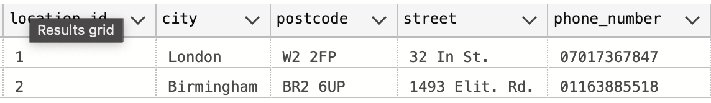

```sql
create table Courses(
    course_id int IDENTITY(1,1) PRIMARY KEY not null,
    course_name varchar(50) not null,
    trainer_id int FOREIGN key REFERENCES Trainers(trainer_id),
    stream_id int FOREIGN key REFERENCES Streams(stream_id),
    location_id int FOREIGN key REFERENCES Locations(location_id)
);

INSERT INTO Courses(course_name)
VALUES
  ('Eng100'),
  ('Data32'),
  ('BA90'),
  ('Eng120'),
  ('Data54');
  
INSERT INTO Courses(course_name, trainer_id, stream_id, location_id)
VALUES
  ('Eng100', 1, 2, 1),
  ('Data32', 2, 1, 1),
  ('BA90', 3, 4, 2),
  ('Eng120', 4, 2, 1),
  ('Data54', 5, 5, 2);

  select * from Courses;
```


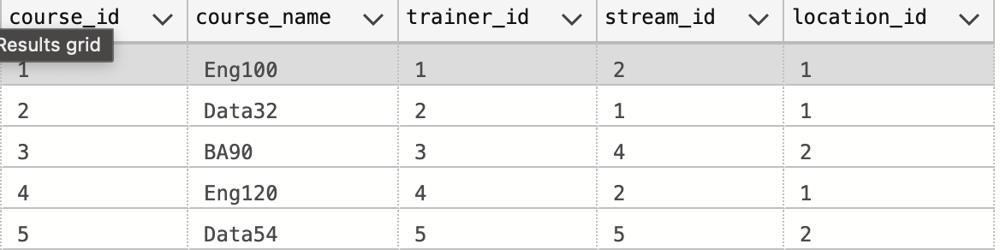

```sql
create table Trainee_Courses(
    trainee_id int foreign key (trainee_id) REFERENCES Trainees(trainee_id),
    course_id int FOREIGN key (course_id) REFERENCES Courses(course_id)
);

INSERT into Trainee_Courses(trainee_id, course_id)
VALUES
    (1,3),
    (2,3),
    (3,4),
    (4,5);
```

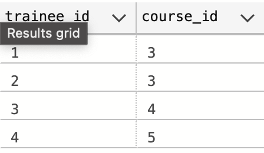


```sql
-- trainers name and surname with location in one column
select first_name + ', ' + last_name + ': ' + course_name as 'First Name, Last Name: Course Name'
from Trainers t
inner join Courses c
on t.trainer_id = c.trainer_id
```

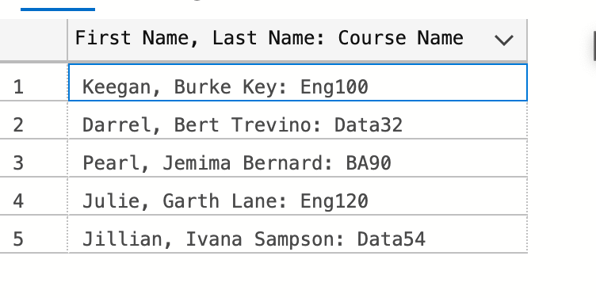


```sql
-- trainers name and surname with location as attached column
select first_name + ', ' + last_name as 'First Name, Last Name',
course_name as 'Course name'
from Trainers t
inner join Courses c
on t.trainer_id = c.trainer_id
```

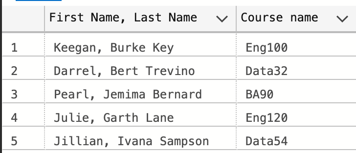


```sql
-- course name with the stream taught
select course_name as 'Course Name',
stream as 'Stream'
from Courses c
inner join Streams s
on s.stream_id = c.stream_id
```

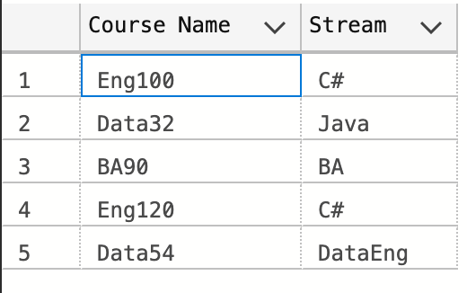


```sql
-- inner join trainers, courses and stream
select first_name + ' ' + last_name as 'First Name, Last Name', + ' ' + course_name + ' ' + stream as 'Course Name, Stream name'
from Trainers t
inner join Courses c
    on t.trainer_id = c.trainer_id 
inner join Streams s
    on c.stream_id = s.stream_id;
```

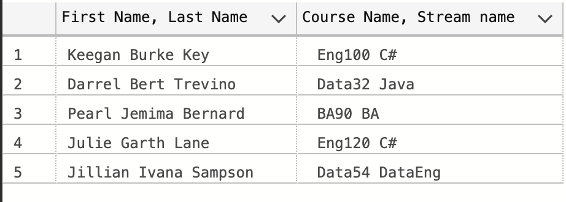


```sql
-- show location and streams
select city, stream
from Courses c
inner join Locations l
    on l.location_id = c.location_id
inner join Streams s
    on s.stream_id = c.stream_id
order by city asc
```

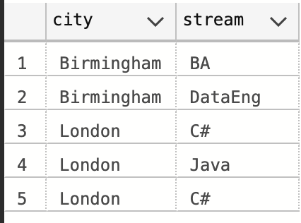


```sql
-- trainers with course name Eng*
select first_name, last_name as 'First, Last', course_name as 'Course' 
from Trainers t
inner join Courses c
    on t.trainer_id = c.trainer_id
where c.course_name like '[En]%'
```


```sql
-- get trainer with course and stream taught ordered by location asc
select first_name + ' ' + last_name as 'First, Last', course_name + ' ' + stream as 'Course: Stream', city as 'City'
from Trainers t
inner join Courses c
    on t.trainer_id = c.trainer_id
inner join Streams s
    on s.stream_id = c.stream_id
inner join Locations l
    on c.location_id = l.location_id
order by city asc
```

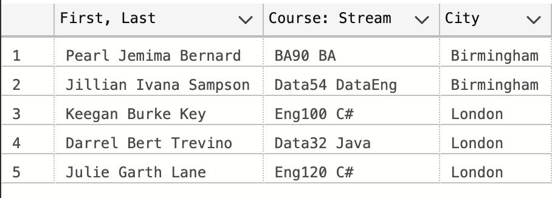


```sql
select first_name + ', ' + last_name + ': ' + salary as 'First name, Last name: Salary'
from Trainers
where salary < 4000
```

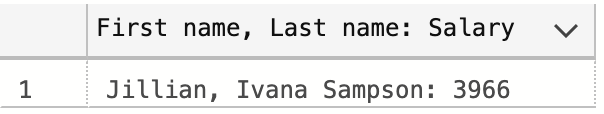


```sql
-- General overview of the DB
```

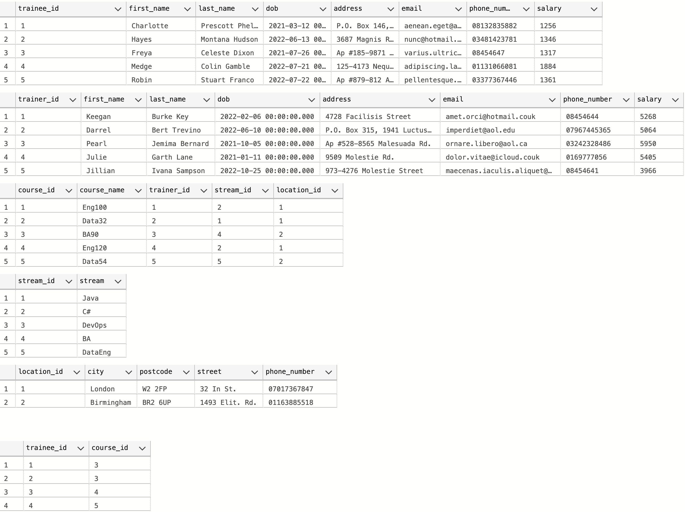

