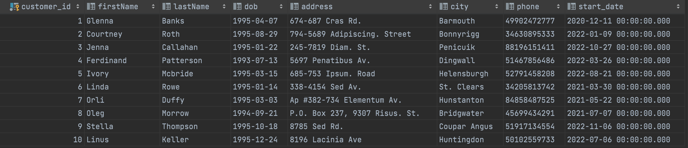
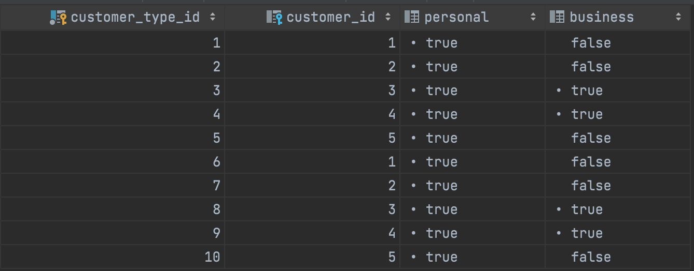
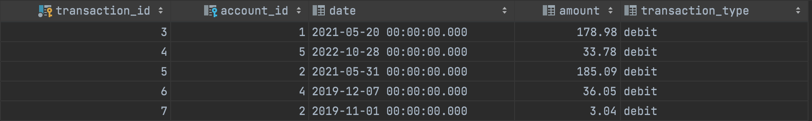

```sql
INSERT INTO [Customers] (firstName,lastName,dob,address,city,phone,start_date)
VALUES
    ('Glenna','Banks','Apr 7, 1995','674-687 Cras Rd.','Barmouth','49902472777','Dec 11, 2020'),
    ('Courtney','Roth','Aug 29, 1995','794-5689 Adipiscing. Street','Bonnyrigg','34630895333','Jan 9, 2022'),
    ('Jenna','Callahan','Jan 22, 1995','245-7819 Diam. St.','Penicuik','88196151411','Oct 27, 2022'),
    ('Ferdinand','Patterson','Jul 13, 1993','5697 Penatibus Av.','Dingwall','51467856486','Mar 26, 2022'),
    ('Ivory','Mcbride','Mar 15, 1995','685-753 Ipsum. Road','Helensburgh','52791458208','Aug 21, 2022'),
    ('Linda','Rowe','Jan 14, 1995','338-4154 Sed Av.','St. Clears','34205813742','Mar 30, 2021'),
    ('Orli','Duffy','Mar 3, 1995','Ap #382-734 Elementum Av.','Hunstanton','84858487525','May 22, 2021'),
    ('Oleg','Morrow','Sep 21, 1994','P.O. Box 237, 9307 Risus. St.','Bridgwater','45699434291','Jul 7, 2021'),
    ('Stella','Thompson','Oct 18, 1995','8785 Sed Rd.','Coupar Angus','51917134554','Nov 6, 2022'),
    ('Linus','Keller','Dec 24, 1995','8196 Lacinia Ave','Huntingdon','50102559733','Jul 6, 2022'),
    ('Trevor','Mccarthy','Jun 7, 2020','815-9976 Rhoncus Street','Dunbar','87563882927','Apr 17, 2017'),
    ('Orli','Freeman','Feb 10, 2021','P.O. Box 867, 3652 Urna, Avenue','Runcorn','85057887835','Feb 2, 2022'),
    ('Geraldine','Mueller','Sep 14, 2017','P.O. Box 799, 2282 Blandit Avenue','Milnathort','47671625515','Dec 4, 2020'),
    ('Allen','Porter','Jul 31, 2021','8751 Ligula. Street','Rhyl','61575332482','Sep 9, 2017'),
    ('Barry','Norman','May 18, 2019','953-8377 Ullamcorper. Road','Hexham','55561770495','Aug 15, 2020'),
    ('Bradley','Beard','May 17, 2018','541-4041 Diam St.','Carmarthen','15342143566','Feb 26, 2017'),
    ('Thane','Greer','Oct 29, 2021','Ap #829-3591 Ipsum Ave','Kirkwall','53536373497','Apr 1, 2017'),
    ('Fulton','Cook','Oct 6, 2020','Ap #211-9849 Eu Rd.','Swindon','85444298628','Apr 20, 2017'),
    ('Samantha','Hogan','Jul 26, 2018','P.O. Box 187, 9384 Diam Avenue','Stevenage','12881782616','Dec 14, 2019'),
    ('Idola','Rivera','Jun 6, 2022','Ap #812-3826 Cum St.','Edinburgh','59851121688','Jan 12, 2017');

-- select * from Customers
```



```sql
INSERT INTO [CustomersType] (Personal,Business,Customer_ID)
VALUES
    ('1','0',1),
    ('1','0',2),
    ('0','1',3),
    ('0','1',4),
    ('1','0',5);
    ('1','0',8),
    ('1','0',7),
    ('0','1',3),
    ('0','1',1),
    ('1','0',5);
```




```sql
INSERT INTO [Accounts] (Account_Name,Start_Date,Customer_ID)
VALUES
    ('ullamcorper','Jul 6, 2020',1),
    ('elit,','Feb 16, 2022',2),
    ('velit','Oct 1, 2022',3),
    ('elit','Mar 13, 2021',4),
    ('commodo','Jan 3, 2018',5),
    ('ullamcorper','Jul 6, 2020',9),
    ('elit,','Feb 16, 2022',8),
    ('velit','Oct 1, 2022',6),
    ('elit','Mar 13, 2021',7),
    ('commodo','Jan 3, 2018',10);
```


```sql
INSERT INTO [Transactions] (Account_ID, Date, Amount, Transaction_type)
VALUES
    (1,'May 20, 2021','178.98','debit'),
    (5,'Oct 28, 2022','33.78','debit'),
    (2,'May 31, 2021','185.09','debit'),
    (4,'Dec 7, 2019','360.05','debit'),
    (3,'Nov 1, 2019','3.04','debit'),
    (6,'May 20, 2021','190.98','debit'),
    (8,'Oct 28, 2022','23.78','debit'),
    (7,'May 31, 2021','15.09','debit'),
    (9,'Dec 7, 2019','3.05','debit'),
    (10,'Nov 1, 2019','39.04','debit');

-- select * from Transactions;
```




